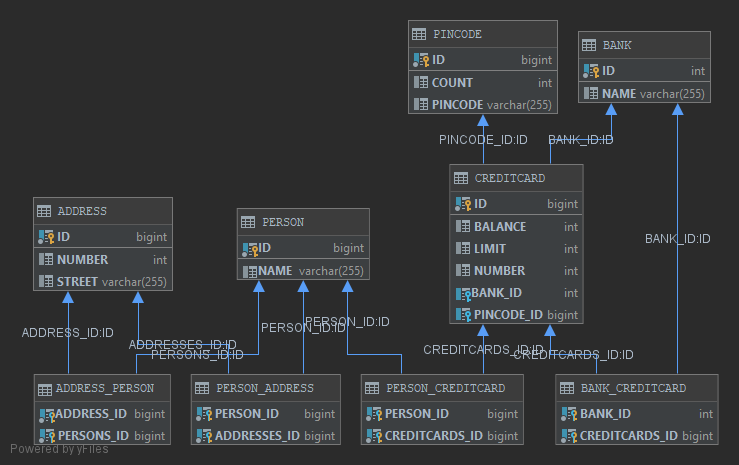

## DAT250: Software Technology Experiment Assignment 2
---
### Technical problems
I had some problems with the version of derby but solved it eventually.

### Experiment 1: Application using JPA
I used the built in Database tool in IntelliJ\
\
[Code](https://github.com/bernhus/dat250/tree/master/lab2/eclipselink/jpa-basic/src/main/java/no/hvl/dat250/jpa/basicexample/exp1)\
### Experiment 2: Banking/Credit Card example JPA
Used the built in Database tool in IntelliJ.\
Visualisation of the database:\
\
Looked at the foreign keys to verify the object links.\
[Code](https://github.com/bernhus/dat250/tree/master/lab2/eclipselink/jpa-basic/src/main/java/no/hvl/dat250/jpa/basicexample/exp2)
