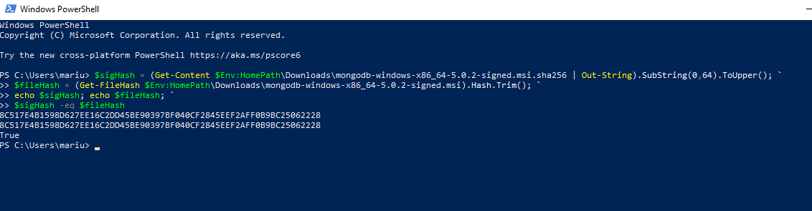
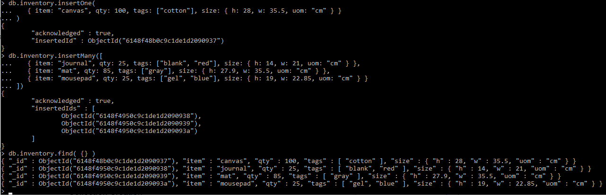
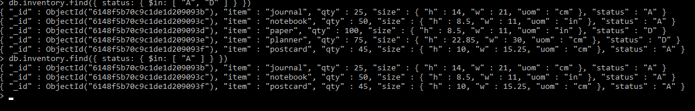
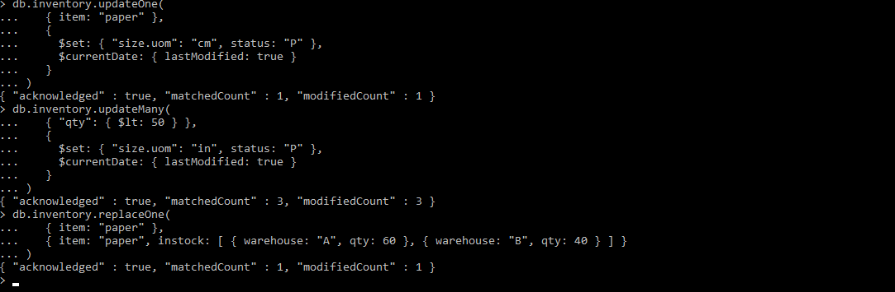
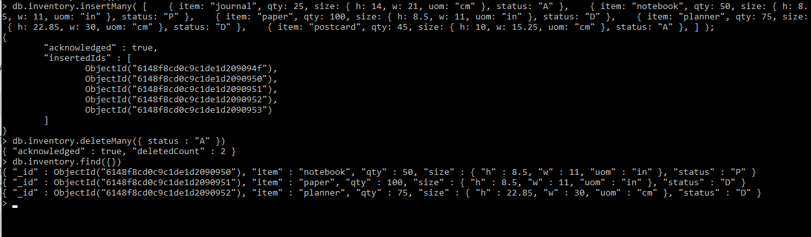
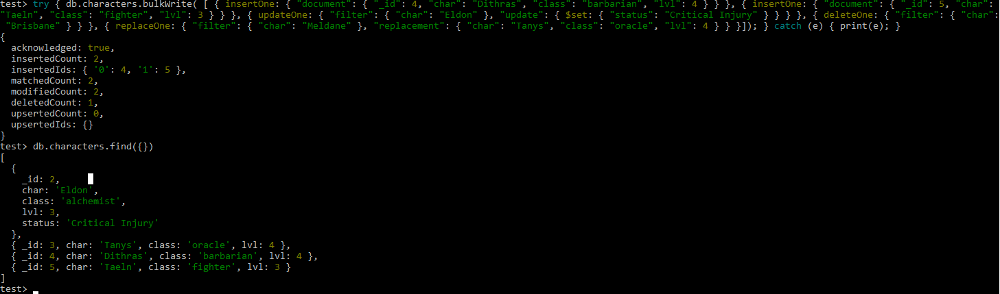
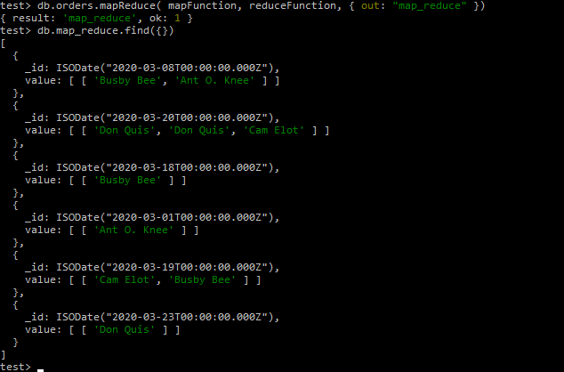

## DAT250: Software Technology Experiment Assignment 3

#### Installation of MongoDB

* The correct validation of the installation package:

Experiment 1
  ---
* Screenshots:
    * Insert documents:
    
    
    * Query documents
    
    
    * Update documents:
    
    
    * Remove documents:
    
    
    * Bulk write operations:
    
    (tiny problem with pasting the code into the cmd so opened the mongosh scipt for the bulk write operations.)
    
    

Experiment 2    
  ---
  Shows a new map_reduce table where the customer identity is mapped onto the date som you are able to se the customers making an order on a given date.
    
    var mapFunction = function () {
        emit(this.ord_date, this.cust_id); 
    };
    
    var reduceFunction = function (keyDate, valueCustId) { 
        return Array(valueCustId); 
    };
  
  
  

#### Pending Isssues
No pending issues.